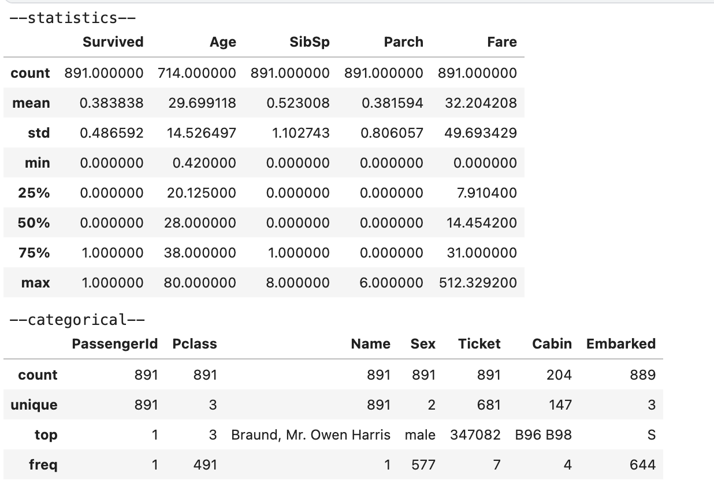
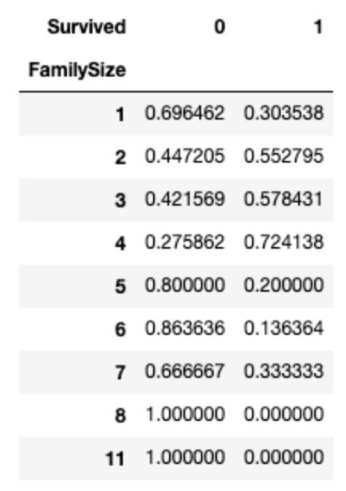
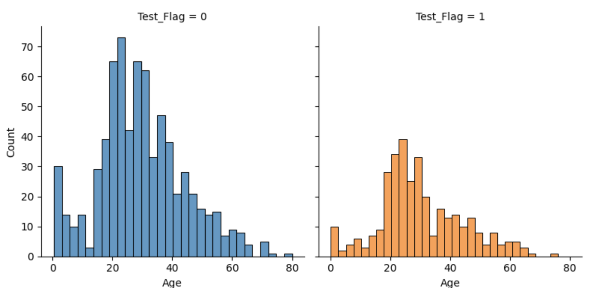
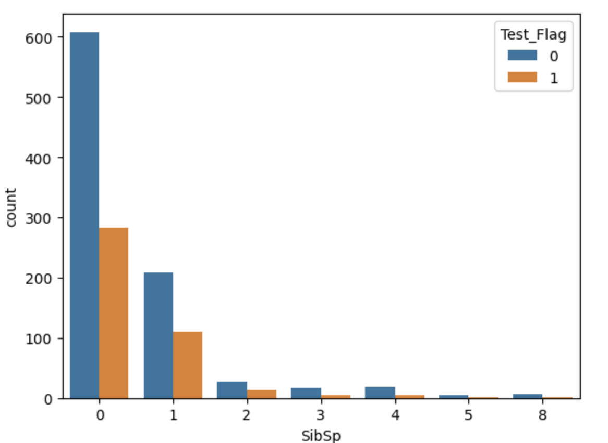
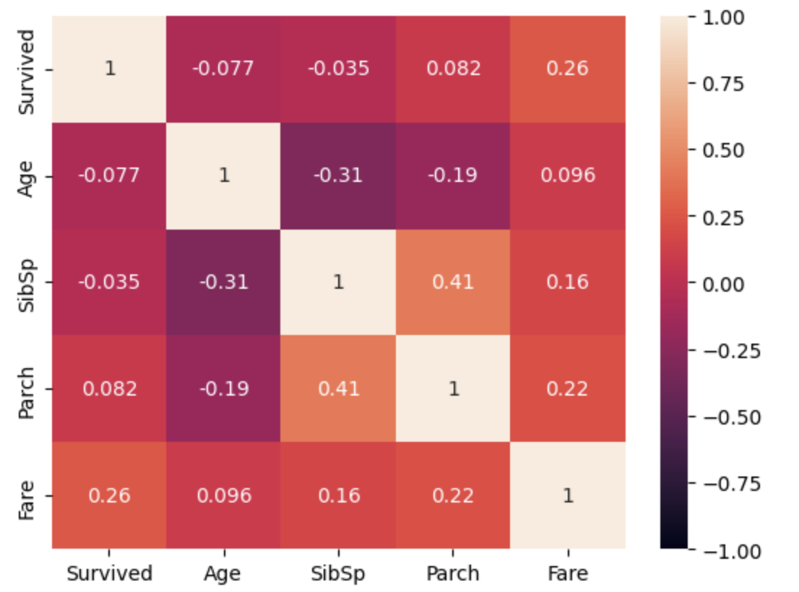

<!-- <<<<<<< HEAD -->
# kaggle_tips

This repository provides kaggle tips that YAMASHITA made.
This content is intended for titanic competition.

[titanic](https://www.kaggle.com/competitions/titanic) 

## データのチェック、整形

- データの読み込み

```python
train_df = pd.read_csv('/kaggle/input/titanic/train.csv')
test_df = pd.read_csv('/kaggle/input/titanic/test.csv')
sample_sub = pd.read_csv('/kaggle/input/titanic/gender_submission.csv')
```

- データの確認

```python
def display_pd(data):
    print(f'Train_df_shape : {data.shape}\n')
    print(f'{data.dtypes} \n')
    display(data.head())
```


- 統計量、カテゴリカルデータに分けて解析

```python
def analysis_pd(data):
    data = data.astype(
        {
        'PassengerId' : str,
        'Pclass' : str 
        }
    )
    print('--statistics--')
    display(data.describe())
    print('--categorical--')
    display(data.describe(exclude='number'))
    
    # return changed data <-- after astype
    return data

da
```



- 欠損値補完

上記のデータを見るとAgeについてcountが891に達していないことから欠損値があることが確認

欠損値をデータの中央値で補完

```python
all_df['Age'] =  all_df['Age'].fillna( all_df['Age'].median())
```

欠損値をNANで補完

```python
all_df['Embarked'] =  all_df['Embarked'].fillna('NaN')
```

- データのカテゴリカル変数化

最大値や最小値が平均から大きくずれている場合、外れ値があることが予想できる

データをいくつかの区間に分け、カテゴリカル変数として扱うことで外れ値による影響を

低減できる。

```python
# Fareのデータを4つの区間に分類し、カテゴリカル変数として扱う
all_df['FareBand'] = pd.qcut(all_df['Fare'], 4)
```

- カテゴリカル変数のOne-Hot-Encoding

モデルが扱えるように、カテゴリカル変数をOne-hotのベクトルに変換

```python
# EmbarkedをOne-Hot Encodingで変換
all_df = pd.get_dummies(all_df, columns=['AgeBand','FareBand','Embarked'])
```

- 新たなデータの作成

```python
# 同乗した家族の人数 = 兄弟・配偶者の人数 + 両親・子供の人数 + 本人
train_df['FamilySize'] = train_df['SibSp'] + train_df['Parch'] + 1

# 1人で乗船した人のカテゴリーを作成
# 1人で乗船した人を1, 2人以上で乗船した人を0
train_df['Alone'] = train_df['FamilySize'].map(lambda s: 1 if  s == 1  else 0)
```

- データの割合の確認

```python
# 家族人数毎の生存率
display(pd.crosstab(train_df['FamilySize'], train_df['Survived'], normalize='index'))
```



- 

## データの可視化

- ベン図による重複度合いの確認

```python
import matplotlib.pyplot as plt
from matplotlib_venn import venn2

fig ,axes = plt.subplots(figsize=(8,8),ncols=3,nrows=1)

for col_name,ax in zip(
    ['Sex','Ticket','Embarked']
    ,axes.ravel()
    ):
    venn2(
        # train_dfとtest_dfのユニークな要素を抽出し、セットにする
        subsets=(set(train_df[col_name].unique()), set(test_df[col_name].unique())),
        set_labels=('Train', 'Test'),
        ax=ax
    )
    ax.set_title(col_name)
```


- グラフでのプロット　（分布の確認）

```python
import seaborn as sns
# Ageについて可視化 
fig = sns.FacetGrid(all_df, col='Test_Flag', hue='Test_Flag', height=4)
fig.map(sns.histplot, 'Age', bins=30, kde=False)
```



- データの値ごとにチェック

```python
# SibSpについて可視化
sns.countplot(
    x='SibSp'
    ,hue='Test_Flag', data=all_df
    )
plt.show()
```



- データの値ごとにチェック（`hue = "Survived"`） 生き残った割合をプロット

```python
sns.countplot(x='Pclass', hue='Survived', data=train_df) 
plt.show()
```


- ヒートマップによる相関のチェック

```python
sns.countplot(x='Pclass', hue='Survived', data=train_df) 
plt.show()
```



## モデルの検証

- データの分割

```python
from sklearn.model_selection import train_test_split

# 前処理を施したall_dfを訓練データとテストデータに分割
train = all_df[all_df['Test_Flag']==0]
test = all_df[all_df['Test_Flag']==1].reset_index(drop=True)

# 訓練データのSurvivedをtargetにする
target = train['Survived']

# 今回学習に用いないカラムを削除
drop_col = [
    'PassengerId','Age',
    'Ticket', 'Fare','Cabin',
    'Test_Flag','Name','Survived'
    ]

train = train.drop(drop_col, axis=1)
test = test.drop(drop_col, axis=1)

# 訓練データの一部を分割し検証データを作成
# 注意 :   
# shuffleをTrueにするとランダムに分割されます。
# この時、random_stateを定義していないとモデルの再現性が取れなくなるので、設定するよう心がけてください。
# test_size=0.2とすることで訓練データの２割を検証データにしている
X_train ,X_val ,y_train ,y_val = train_test_split(
    train, target, 
    test_size=0.2, shuffle=True,random_state=0
    )
```

- モデルの学習

```python
from sklearn.linear_model import LogisticRegression
from sklearn.metrics import accuracy_score

# モデルを定義し学習
model = LogisticRegression() 
model.fit(X_train, y_train)

# 訓練データに対しての予測を行い、正答率を算出
y_pred = model.predict(X_train)
print(accuracy_score(y_train, y_pred))
```

- 評価データの検証

```python
y_pred_val = model.predict(
    X_val
    )

# 予測結果を正答率で評価
print(accuracy_score(
        y_val, y_pred_val
        )
    )
```

- テストデータの検証と提出ファイルの作成

```python
# テストデータを予測
test_pred = model.predict(test)

# 予測結果をサブミットするファイル形式に変更
sample_sub["Survived"] = np.where(test_pred>=0.5, 1, 0)
display(sample_sub.head(10))

# 提出ファイルを出力
sample_sub.to_csv("submission.csv", index=False)
```

- K-fold検証
```python
from sklearn.model_selection import KFold

# n_splits で分割数が指定できます。3,5,10分割がよく用いられる分割数になります。
cv = KFold(n_splits=5, random_state=0, shuffle=True)

# fold毎に学習データのインデックスと評価データのインデックスが得られます
for i ,(trn_index, val_index) in enumerate(cv.split(train, target)):
    
    print(f'Fold : {i}')
    # データ全体(Xとy)を学習データと評価データに分割
    X_train ,X_val = train.loc[trn_index], train.loc[val_index]
    y_train ,y_val = target[trn_index], target[val_index]
    
    print(f'Train : {X_train.shape}')
    print(f'Valid : {X_val.shape}')
```
